# ESEEDS: An Automated Agricultural Seeds Vending Machine
This project was developed by Martin Lawrence M. Caringal in fulfillment of the requirements for the Bachelor of Science in Information Technology. It consists of both hardware and software interfaces and utilizes the principles of the Internet of Things (IoT).

The software includes a web server built with vanilla PHP for the admin user interface, which features an inventory management system for tracking products, as well as real-time monitoring of the vending machine. Additionally, SMS notifications are enabled using a GSM module, allowing remote monitoring and price updates.

The hardware features an Arduino Mega microcontroller with an Ethernet shield, a coin changer, and an uninterruptible power supply (UPS) for continuous operation. An EEPROM is also used to store critical data, ensuring high availability and data retention even during power interruptions.

This project was developed between 2020 and 2021.

## Screenshots Documentation

This document displays all screenshots of the Project.

## Dashboard & Administration

### 2-Dashboard
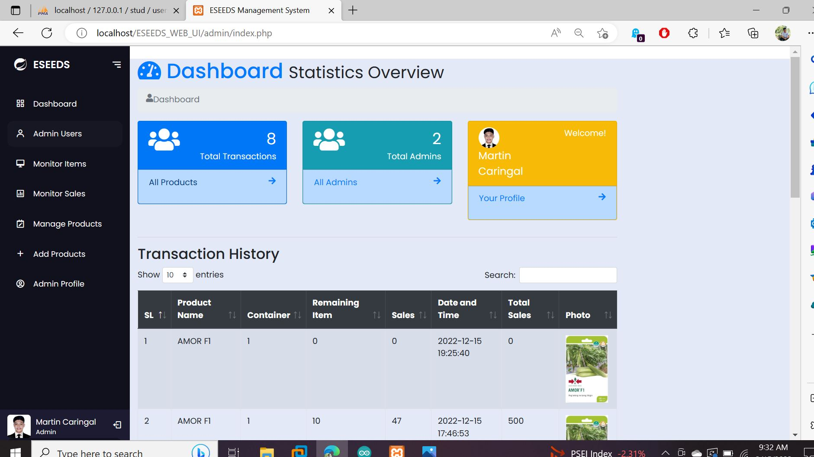

### Dashboard
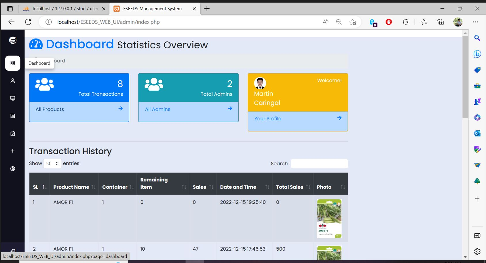

### Admins
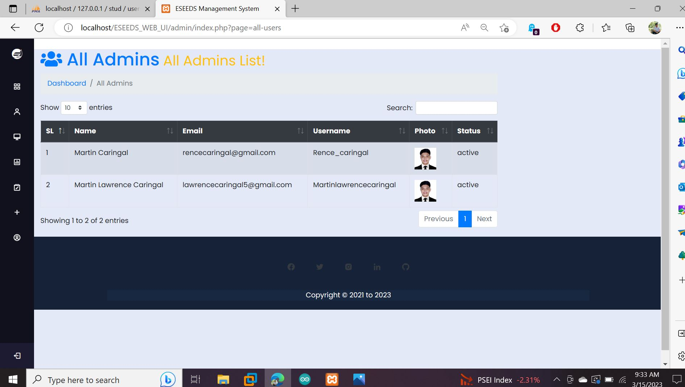

### Login
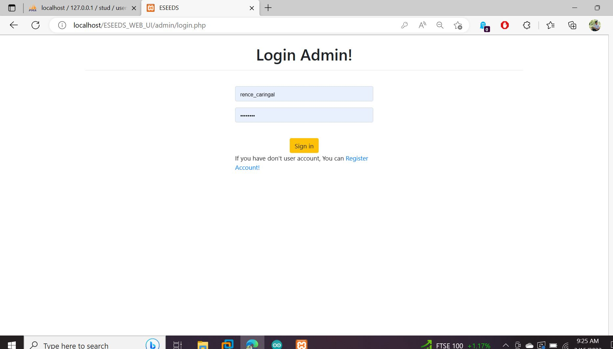

### Register
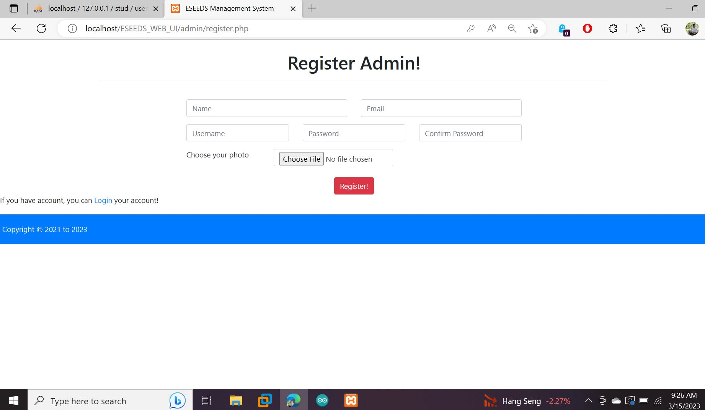

## Product Management

### Add New Product
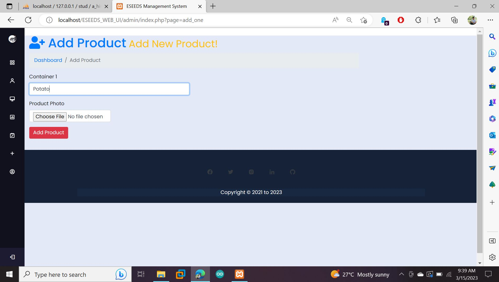

### Product List
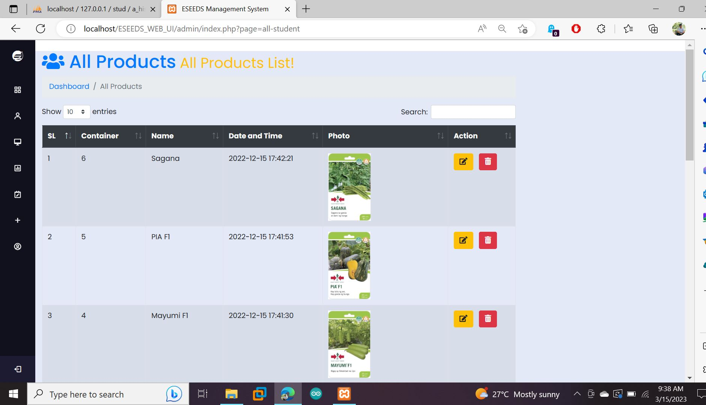

### Default Display
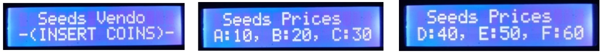

## Sales & Transactions

### Sales
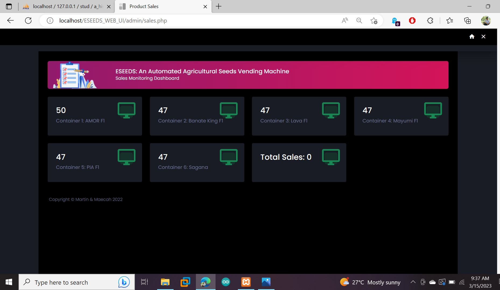

### Selection
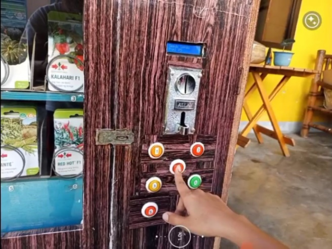

## Vending Operations

### Coin Insertion
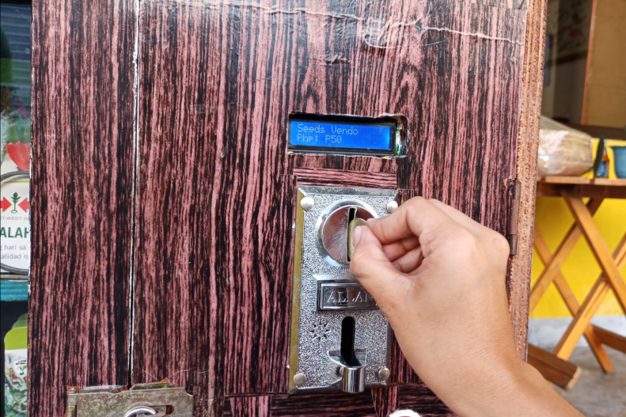

### Inserted Coin
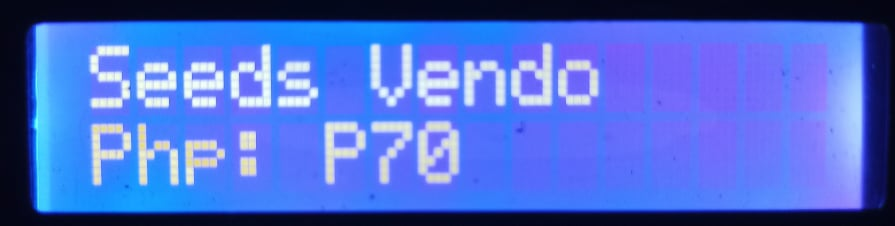

### Insufficient Pay
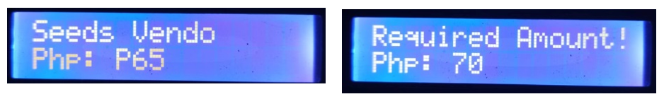

### Dispensing
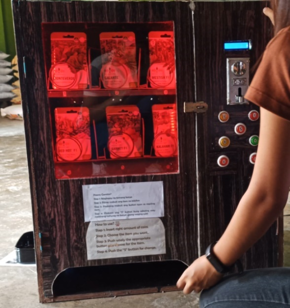

### Dispensed
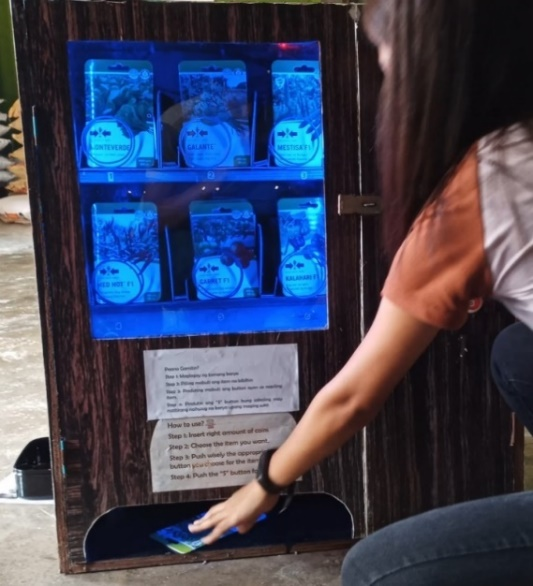

### Processing
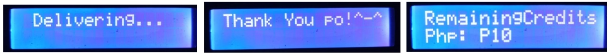

## Monitoring & Notifications

### Web Remaining Monitoring
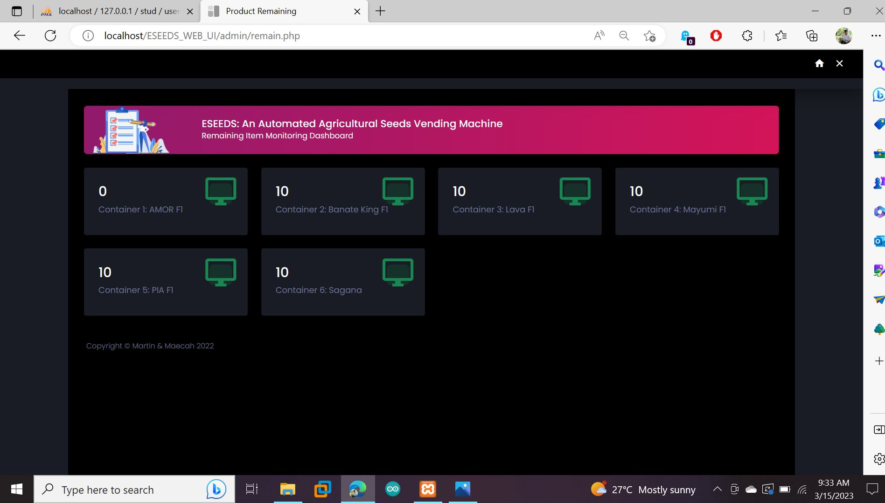

### Mobile SMS Notifications
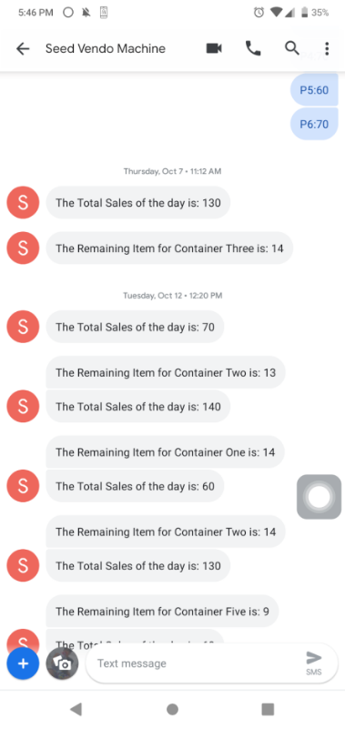

---
